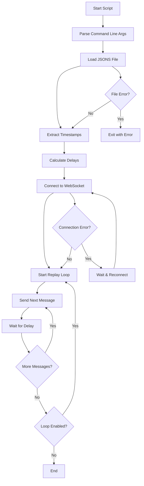
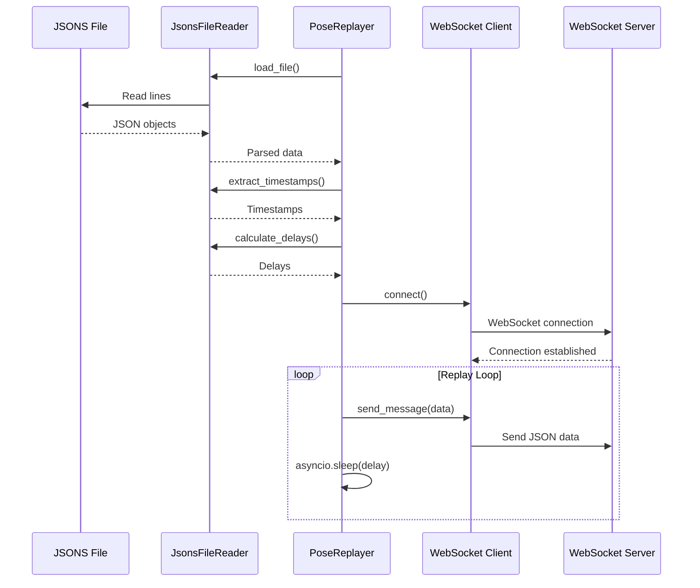

# Pose Replayer Script Summary

## Overview
The `pose_replayer.py` script is designed to read pose data from a JSONS file (JSON Lines format) and replay it to a WebSocket endpoint with proper timing based on timestamps in the data. The script will loop indefinitely when reaching the end of the file.

## Architecture Diagram



## Key Components

### 1. JsonsFileReader
- **Purpose**: Read and parse JSON Lines format files
- **Key Methods**:
  - `load_file()`: Load all JSON objects from file
  - `extract_timestamps()`: Extract timestamps from JSON objects
  - `calculate_delays()`: Calculate delays between messages

### 2. WebSocketClient
- **Purpose**: Manage WebSocket connection with reconnection logic
- **Key Methods**:
  - `connect()`: Establish connection with retry logic
  - `message_sender()`: Send queued messages reliably
  - `send_message()`: Queue message for sending

### 3. PoseReplayer
- **Purpose**: Main controller orchestrating the replay process
- **Key Methods**:
  - `setup()`: Initialize all components
  - `replay_loop()`: Main replay logic with timing
  - `run()`: Entry point and main loop

## Command Line Interface

```bash
python pose_replayer.py \
  --file 2025-11-13_pleza.jsons \
  --websocket ws://localhost:8000/ws/pose/ \
  --timestamp-field timestamp \
  --loop \
  --debug
```

### Arguments:
- `--file`: Path to input JSONS file (required)
- `--websocket`: WebSocket endpoint URL (required)
- `--timestamp-field`: Field name containing timestamp (default: "timestamp")
- `--no-loop`: Disable looping (play once)
- `--reconnect-delay`: Delay between reconnection attempts (default: 5.0s)
- `--debug`: Enable debug logging

## Data Flow



## Error Handling Strategy

1. **File Errors**:
   - File not found
   - Invalid JSON format
   - Missing timestamps

2. **WebSocket Errors**:
   - Connection failures
   - Network interruptions
   - Server unavailability

3. **Timing Errors**:
   - Invalid timestamp formats
   - Out-of-order timestamps
   - Negative delays

## Integration with Existing Codebase

The script follows patterns established in:
- `websocket_pose_session_tracker.py` for WebSocket implementation
- Uses `loguru` for logging (already in requirements)
- Follows the project's async/await patterns
- Uses similar error handling approaches

## Performance Considerations

1. **Memory Usage**:
   - For small files: Load entire file into memory
   - For large files: Implement streaming reader (optional)

2. **Timing Accuracy**:
   - Use `asyncio.sleep()` for precise timing
   - Handle clock drift if replaying for long periods

3. **Network Efficiency**:
   - Queue messages to handle temporary disconnections
   - Batch sends if needed (future enhancement)

## Testing Strategy

1. **Unit Tests**:
   - Test file reading with various JSON formats
   - Test timestamp extraction and parsing
   - Test delay calculations

2. **Integration Tests**:
   - Test WebSocket connection and reconnection
   - Test end-to-end replay with mock server
   - Test timing accuracy

3. **Edge Cases**:
   - Empty files
   - Single message files
   - Files with missing timestamps
   - Network interruptions during replay

## Usage Examples

### Basic Usage
```bash
python pose_replayer.py \
  --file recorded_session.jsons \
  --websocket ws://localhost:8000/ws/pose/
```

### With Custom Timestamp Field
```bash
python pose_replayer.py \
  --file session.jsons \
  --websocket ws://localhost:8000/ws/pose/ \
  --timestamp-field created_at
```

### Single Playback (No Loop)
```bash
python pose_replayer.py \
  --file session.jsons \
  --websocket ws://localhost:8000/ws/pose/ \
  --no-loop
```

### Debug Mode
```bash
python pose_replayer.py \
  --file session.jsons \
  --websocket ws://localhost:8000/ws/pose/ \
  --debug
```

## Future Enhancements

1. **Speed Control**: Adjust replay speed (faster/slower)
2. **Interactive Controls**: Start/stop/pause during replay
3. **Progress Reporting**: Show current position and ETA
4. **Multiple Outputs**: Send to multiple WebSocket endpoints
5. **GUI Interface**: Web-based control panel
6. **Live Monitoring**: Real-time statistics and metrics

## Dependencies

The script uses only existing dependencies from the project:
- `websockets` (WebSocket client)
- `loguru` (Logging)
- `asyncio` (Async programming)
- Standard library modules (json, argparse, datetime, etc.)

No additional dependencies need to be added to requirements.txt.