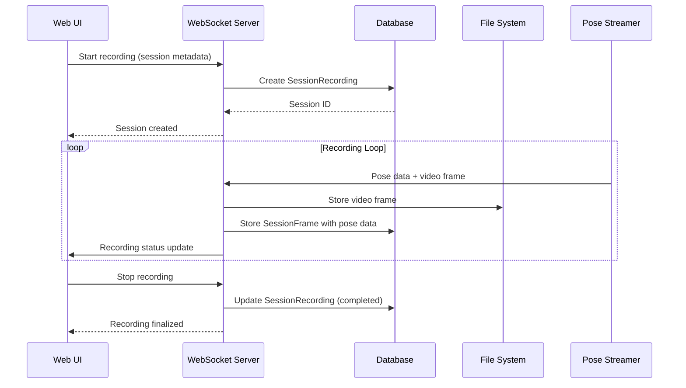
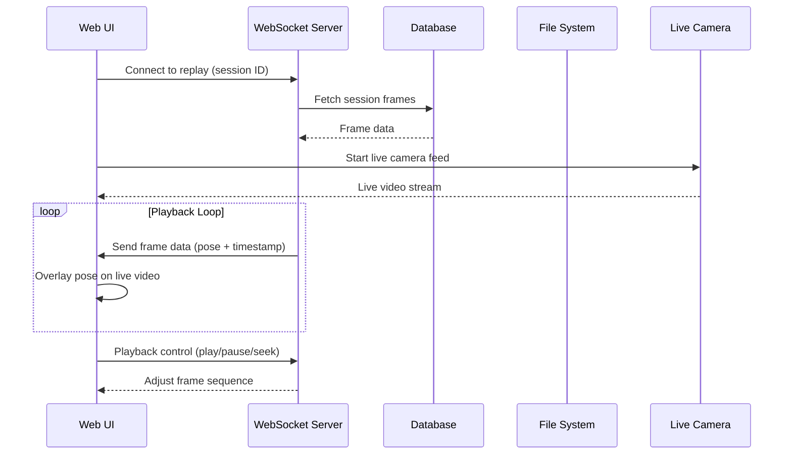
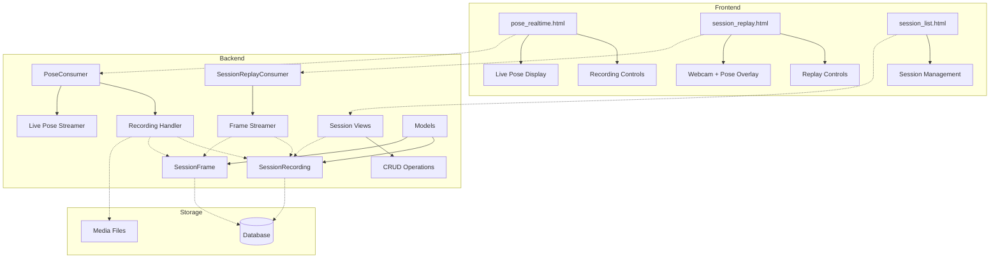

# System Architecture Diagram

## Recording Flow



## Replay Flow



## Component Architecture



## Database Schema

```mermaid
erDiagram
    User ||--o{ SessionRecording : creates
    SessionRecording ||--o{ SessionFrame : contains
    
    User {
        int id PK
        string username
        string email
        string password
    }
    
    SessionRecording {
        uuid id PK
        string name
        text description
        datetime created_at
        int duration
        int frame_count
        int user_id FK
        string video_file_path
        string status
    }
    
    SessionFrame {
        int id PK
        uuid session_id FK
        float timestamp
        int frame_number
        json pose_data
        string image_path
    }