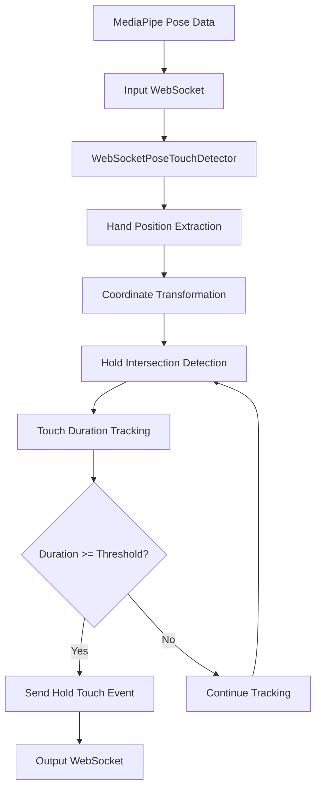
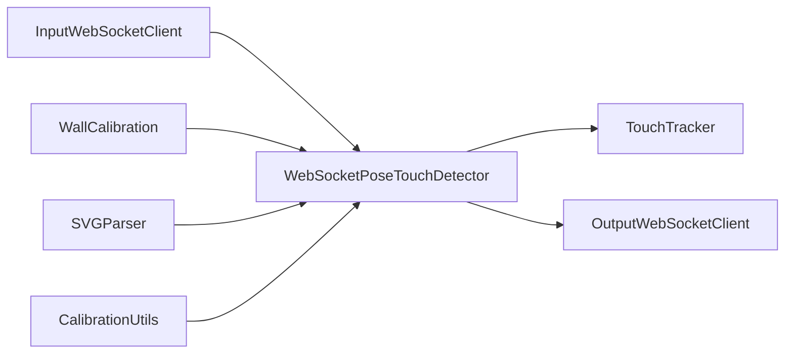

# WebSocket Pose Touch Detector - Implementation Summary

## Overview
This document provides a comprehensive summary of the planned WebSocket-based pose touch detector management command for the ProjectClimb climbing wall system.

## Purpose
Create a Django management command that:
1. Connects to a WebSocket to receive MediaPipe pose data
2. Transforms coordinates according to active wall calibration
3. Detects when hands touch holds in the wall's SVG file
4. Sends hold touch events to another WebSocket when holds are touched for a predefined duration

## Key Features

### 1. Dual WebSocket Architecture
- **Input WebSocket**: Receives MediaPipe pose data in real-time
- **Output WebSocket**: Sends hold touch events when touch duration threshold is met
- **Reconnection Logic**: Automatic reconnection with exponential backoff for both connections

### 2. Touch Duration Tracking
- **Configurable Threshold**: Default 1.0 second, configurable via command line
- **Per-Hold Tracking**: Independent tracking for each hold
- **Single Event Per Touch**: Prevents duplicate events for continuous touches

### 3. Coordinate Transformation
- **Wall Calibration Integration**: Uses existing wall calibration data
- **SVG Coordinate System**: Transforms pose coordinates to SVG coordinate space
- **Hold Intersection Detection**: Uses existing SVG parsing utilities

### 4. Robust Error Handling
- **Connection Recovery**: Handles WebSocket disconnections gracefully
- **Data Validation**: Validates incoming pose data format
- **Comprehensive Logging**: Structured logging with loguru

## Implementation Files

### 1. Main Command File
**Location**: `code/climber/management/commands/websocket_pose_touch_detector.py`

**Key Classes**:
- `WebSocketPoseTouchDetector`: Main orchestrator class
- `InputWebSocketClient`: Handles pose data reception
- `OutputWebSocketClient`: Handles event transmission
- `TouchTracker`: Manages touch duration tracking

### 2. Supporting Documentation
- `websocket_pose_touch_detector_implementation.md`: Detailed implementation plan
- `websocket_client_implementation.md`: WebSocket client implementation details
- `testing_strategy.md`: Comprehensive testing strategy

## Command Line Interface

### Usage Example
```bash
python manage.py websocket_pose_touch_detector \
    --wall-id=1 \
    --input-websocket-url=ws://localhost:8001/pose \
    --output-websocket-url=ws://localhost:8002/hold-events \
    --touch-duration=1.0 \
    --reconnect-delay=5.0 \
    --debug
```

### Arguments
- `--wall-id`: ID of wall to process (required)
- `--input-websocket-url`: WebSocket URL for pose data (required)
- `--output-websocket-url`: WebSocket URL for hold events (required)
- `--touch-duration`: Touch duration threshold (default: 1.0s)
- `--reconnect-delay`: Reconnection delay (default: 5.0s)
- `--debug`: Enable debug logging

## Data Formats

### Input Pose Data
```json
{
  "landmarks": [
    {"x": 0.5, "y": 0.3, "z": 0.0, "visibility": 0.9},
    {"x": 0.51, "y": 0.31, "z": 0.01, "visibility": 0.85},
    ...
  ],
  "timestamp": 1234567890.123
}
```

### Output Hold Touch Event
```json
{
  "type": "hold_touch",
  "hold_id": "hold_123",
  "wall_id": 1,
  "timestamp": 1234567890.123,
  "touch_duration": 1.0
}
```

## Technical Architecture

### 1. Data Flow


### 2. Component Interactions


## Reusable Components

### From Existing Codebase
1. **Wall and Calibration Loading**: From existing [`pose_touch_detector.py`](code/climber/management/commands/pose_touch_detector.py:1)
2. **SVG Parsing**: [`SVGParser`](code/climber/svg_utils.py:10) class for hold extraction
3. **Coordinate Transformation**: [`CalibrationUtils.transform_point_to_svg()`](code/climber/calibration/calibration_utils.py:284)
4. **Touch Detection Logic**: Adapted from [`_check_touch_at_position()`](code/climber/management/commands/pose_touch_detector.py:353)

### New Components
1. **WebSocket Clients**: Robust client implementations with reconnection logic
2. **Touch Duration Tracking**: New `TouchTracker` class for time-based touch detection
3. **Message Validation**: Input data validation and error handling
4. **Async Event Loop**: Main asyncio-based processing loop

## Performance Considerations

### 1. Processing Rate
- **Target**: 30+ FPS pose data processing
- **Optimization**: Efficient coordinate transformation and intersection detection
- **Memory Management**: Minimal memory footprint for long-running processes

### 2. Network Reliability
- **Reconnection Strategy**: Exponential backoff with maximum delay
- **Message Queuing**: Output client queues events during disconnections
- **Connection Monitoring**: Health checks and automatic recovery

### 3. Error Recovery
- **Graceful Degradation**: Continue processing when individual components fail
- **Data Validation**: Skip invalid pose data without stopping processing
- **Resource Cleanup**: Proper cleanup on shutdown

## Testing Strategy

### 1. Unit Tests
- **Coordinate Transformation**: Test with known calibration data
- **Touch Duration Tracking**: Verify timing logic
- **WebSocket Clients**: Test connection handling and reconnection
- **Hand Position Extraction**: Test landmark processing

### 2. Integration Tests
- **End-to-End Flow**: Complete data processing pipeline
- **Mock WebSocket Servers**: Simulate real WebSocket connections
- **Database Integration**: Test with real wall and calibration data

### 3. Performance Tests
- **High-Frequency Data**: Test with 30+ FPS input
- **Memory Usage**: Monitor memory over extended periods
- **Network Latency**: Test with various network conditions

## Dependencies

### Required Python Packages
- `websockets`: WebSocket client implementation
- `numpy`: Numerical operations and coordinate transformations
- `loguru`: Structured logging
- `django`: Django management command framework

### Django Dependencies
- `climber.models.Wall`: Wall data access
- `climber.models.WallCalibration`: Calibration data access
- `climber.svg_utils.SVGParser`: SVG parsing and intersection detection
- `climber.calibration.calibration_utils.CalibrationUtils`: Coordinate transformation

## Implementation Steps

### Phase 1: Core Implementation
1. Create basic command structure with argument parsing
2. Implement wall and calibration loading
3. Create WebSocket input client with reconnection logic
4. Implement coordinate transformation using calibration

### Phase 2: Touch Detection
1. Create hold intersection detection using SVG parser
2. Implement touch duration tracking
3. Create WebSocket output client with reconnection logic
4. Add comprehensive error handling and logging

### Phase 3: Testing and Optimization
1. Implement unit tests for all components
2. Create integration tests with mock WebSocket servers
3. Performance testing and optimization
4. Documentation and deployment preparation

## Deployment Considerations

### 1. Environment Setup
- **WebSocket Servers**: Ensure input/output WebSocket servers are running
- **Database**: Wall and calibration data must be properly configured
- **Network**: Firewall rules must allow WebSocket connections

### 2. Monitoring
- **Logging**: Structured logs for troubleshooting
- **Performance Metrics**: Processing rate and error tracking
- **Connection Status**: WebSocket connection health monitoring

### 3. Scaling
- **Multiple Walls**: Can run multiple instances for different walls
- **Load Balancing**: WebSocket servers can be load-balanced
- **Resource Limits**: Monitor CPU and memory usage

## Future Enhancements

### 1. Advanced Features
- **Multi-Wall Support**: Single command handling multiple walls
- **Dynamic Calibration**: Automatic calibration updates
- **Touch Patterns**: Recognition of specific climbing patterns

### 2. Performance Improvements
- **Parallel Processing**: Multi-threaded pose processing
- **GPU Acceleration**: Use GPU for coordinate transformations
- **Caching**: Cache frequently accessed data

### 3. Integration
- **Real-Time Analytics**: Live climbing performance metrics
- **Mobile App Integration**: Connect to mobile climbing apps
- **Cloud Deployment**: Deploy to cloud infrastructure

## Conclusion

The WebSocket-based pose touch detector provides a robust, scalable solution for real-time climbing wall interaction detection. By leveraging existing components and implementing new WebSocket clients with comprehensive error handling, the system can reliably detect hold touches and send events to downstream systems.

The modular design allows for easy testing, maintenance, and future enhancements. The comprehensive testing strategy ensures reliability and performance under various conditions.

This implementation plan provides all necessary details for successful development and deployment of the WebSocket pose touch detector management command.